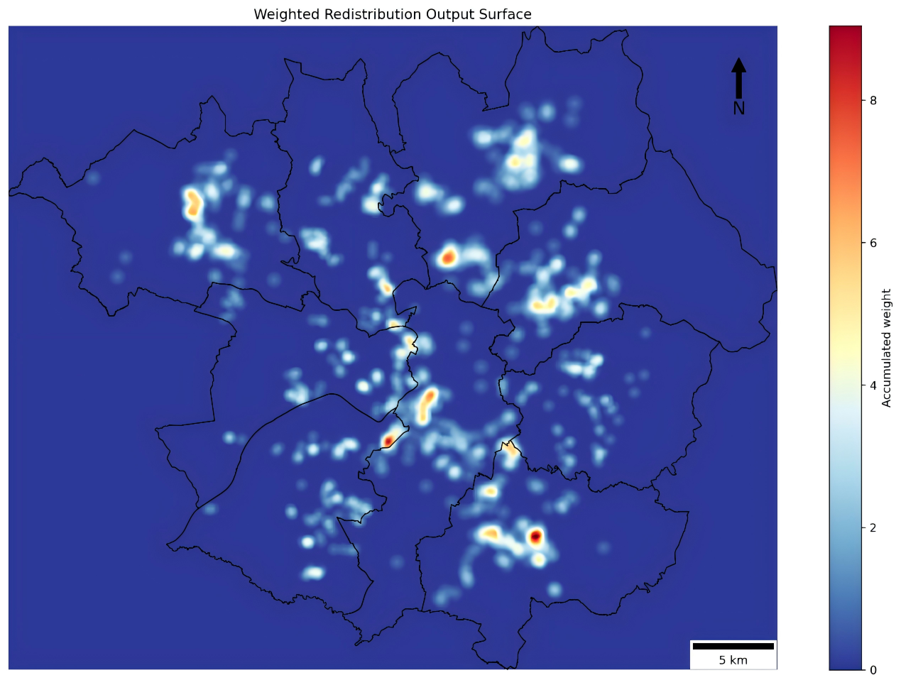
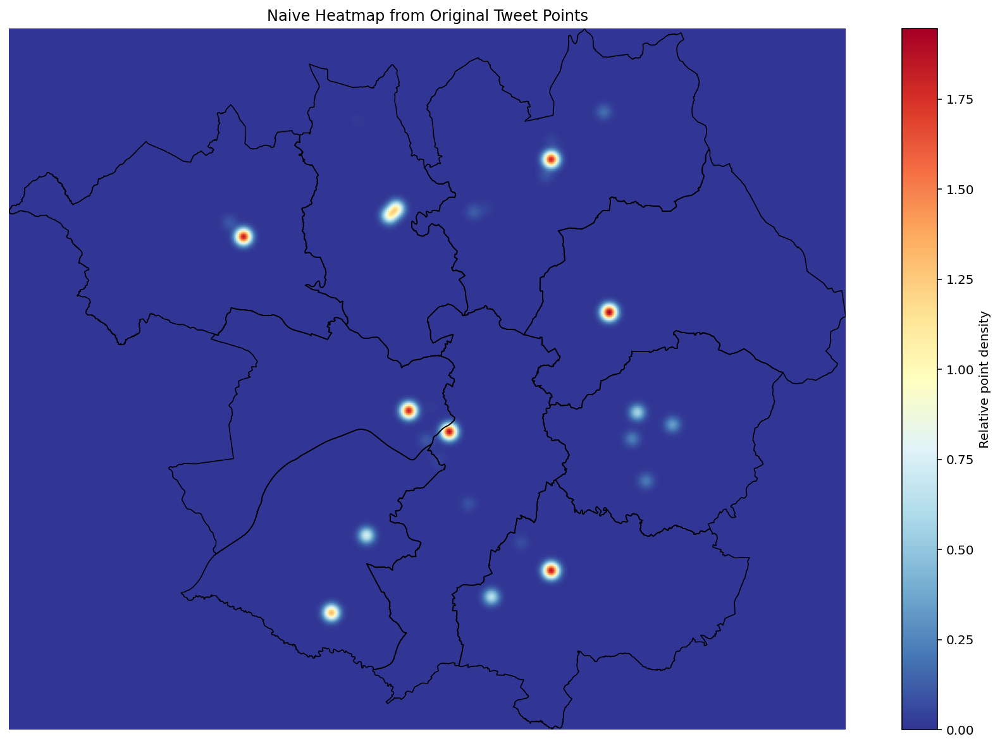
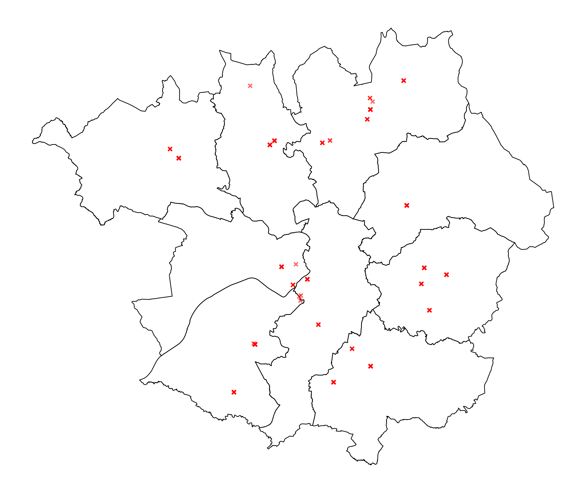
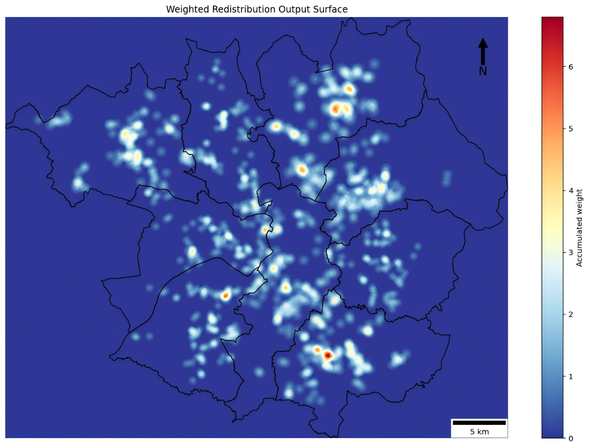
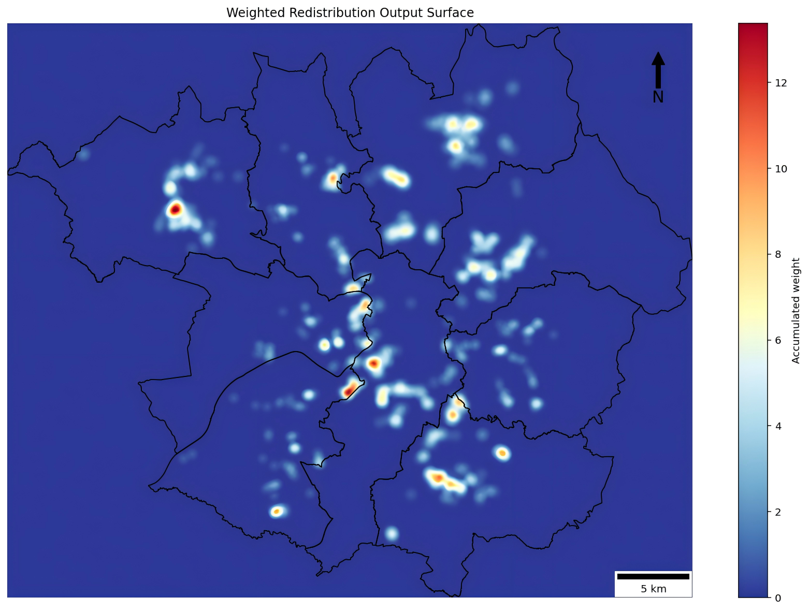

# Greater-Manchester-Tweet-Redistribution

A spatial data science project that applies a **weighted redistribution algorithm** to reduce false hotspots in ambiguously geocoded social media data.

This project uses tweet point data for Greater Manchester and redistributes each point within its administrative unit based on a **population-density weighting surface**, producing a more spatially plausible continuous activity surface than direct point mapping or naive heatmaps.

---

## Project Overview

Spatial point datasets are often affected by **location uncertainty**. In many real-world cases, events are only geocoded to a coarse administrative unit rather than their true location. If these points are mapped directly, the result can be misleading, creating **artificial clusters** that reflect the geometry of reporting units rather than actual activity patterns.

To address this problem, this project implements a **weighted redistribution approach** inspired by Huck et al. (2015). For each ambiguously located tweet:

1. Multiple candidate points are randomly generated within the relevant district
2. A population raster is used to identify the most plausible candidate location
3. The selected point is expanded into a distance-decay surface
4. All individual surfaces are accumulated into a final continuous output raster

The result is a more realistic representation of the spatial distribution of tweet activity across Greater Manchester.

> 
> ## Academic Context
> 
> This repository is adapted from a university coursework project. 
> 
>The core method was introduced in class, and the implementation, results, and write-up presented here were completed by the author.
> 

---

## Results

<h3>Weighted redistribution output</h3>


<h3>Naive heatmap</h3>


Higher cumulative weights are concentrated in Manchester city center, primarily distributed within densely populated urban areas, while most regions within the study area exhibit low or near-zero values. Compared with direct mapping, the redistributed surface，the redistribution one reduces the appearance of artificial hotspots centred on administrative units, concentrates higher weighted values in denser urban areas, produces localised peaks rather than uniform district-centred blobs.

Unlike traditional heatmaps, this surface does not display artificial hotspots centered around administrative centers. The weighted redistribution algorithm disperses activity across zones based on weight distribution, reducing the risk of false hotspots caused by mixed spatial scales in the input data.This makes the result more spatially plausible for exploratory analysis of social media activity.

## Study Area

**Greater Manchester, United Kingdom**

<h3>Population-weighted tweet map</h3>


The analysis uses district boundaries, ambiguously geocoded tweet data, and a population density raster to model likely tweet activity patterns across the city-region.

## Methodology

### 1. Random candidate point generation

Candidate point generation employs a Cartesian random sampling method based on polygonal bounding boxes: uniform random (x, y) coordinates are generated within each district's bounding box, then filtered using the within () function to ensure points fall inside the polygon. 

### 2. Population-weighted candidate selection

The number of candidate points, denoted as n, is one of the key parameters in the Weighted Redistribution algorithm, directly influencing the stability and randomness of the results. When n is small, the redistribution positions are more susceptible to the influence of random sampling; while a larger n enables a more thorough exploration of the high-weight areas within the administrative region, but it also increases the computational cost. When n = 10 there are more hotspots, but they are more scattered. However, when n = 50, hotspots within the district are more stable and the focus is more concentrated in a few specific areas.

### 3. Radius calculation

After that, an influence radius was calculated for each redistributed point based on the size of the administrative area and a scaling parameter.

### 4. Distance-decay redistribution

Each selected point was then spread into a circular surface using a simple linear distance-decay function.

### 5. Output surface generation

Finally, all redistributed surfaces were added together to produce a continuous map showing the likely spatial pattern of tweet activity.

## Key Features

- Handles **spatially ambiguous point data**
- Uses **population density** as a weighting surface
- Produces a **continuous redistribution surface**
- Includes basic robustness controls:
    - maximum attempts for random point generation
    - skipping NoData raster cells
- Visualises the result as a mapped output with:
    - district boundaries
    - colour bar
    - north arrow
    - scale bar


## Sensitivity to Parameters

This project explored how the number of candidate points (`n_candidates`) affects redistribution behaviour. **Lower values** (e.g. 10) produce more scattered hotspots. **Higher values** (e.g. 50) produce more stable and concentrated outputs. A mid-range setting was used as a practical balance between stability and computational.

This highlights that weighted redistribution is sensitive to parameter choice and should be interpreted carefully.


## Project Structure

```bash
## Project Structure

weighted-redistribution/
├── document/
│   └── weighted redistribution of tweet data.pdf
├── figure/
│   ├── n_candidates_10.png
│   ├── n_candidates_20.png
│   ├── n_candidates_50.png
│   ├── naive_heatmap.png
│   └── pop_tweets_map.png
├── script/
│   └── Weighted Redistribution of tweet data.py
└── README.md
```
## Example Output

### Weighted redistribution output surface

<h3>Weighted redistribution output</h3>


<h3>Weighted redistribution output</h3>


### Parameter comparison
You may also include additional figures comparing different parameter values, for example:

- `n_candidates = 10`
- `n_candidates = 20`
- `n_candidates = 50`

These help demonstrate the sensitivity and robustness of the redistribution process.

## Limitations

The algorithm relies exclusively on population density as the weighting surface. However, tweet activity in urban environments is shaped by a range of additional factors, including land-use characteristics (for example, shopping centres, transport hubs, and parks), mobile network coverage, and demographic differences among users. The omission of these factors means that some patterns of social media activity may not be fully captured by the current weighting scheme.

Furthermore, the population dataset used in this study represents conditions in 2019. Subsequent changes in urban development and population distribution within Greater Manchester may introduce discrepancies between the weighting surface and present-day conditions, potentially affecting the accuracy of the redistribution results.

## References

Huck, J., Whyatt, D. and Coulton, P. (2015). *Visualizing patterns in spatially ambiguous point data*. Journal of Spatial Information Science, 10, 47–66.

van der Walt, S. et al. (2014). *scikit-image: image processing in Python*. PeerJ, 2, e453.

## Author
Ziyao Zhao

MSc GIS| The university of Manchester
